# 🚀 Ngx Version View

<div align="center">

<p align="center">
  
</p>

[](https://www.npmjs.com/package/ngx-version-view)
[](https://opensource.org/licenses/MIT)
[](https://github.com/zenkiet/ngx-version-view/actions)
[](http://makeapullrequest.com)
[](https://angular.io)
[](https://github.com/zenkiet/traefik-tunnel-expose/stargazers)

<p align="center">
  <strong>🎯 Smart Version-Aware Angular Library for Progressive Feature Management</strong>
</p>

A powerful Angular library that revolutionizes feature management through intelligent version-aware component rendering and routing. Perfect for progressive feature rollouts, maintaining backward compatibility and sophisticated release management strategies.

[ Quick Start](#-quick-start) • [💬 Discussions](https://github.com/zenkiet/traefik-tunnel-expose/discussions)

</div>

---

## ✨ Core Features

| Feature                              | Description                                                            |
| ------------------------------------ | ---------------------------------------------------------------------- |
| **🧩 Version-Aware Components**      | Automatically render different components based on application version |
| **🛤️ Smart Version Routing**         | Route management with automatic version-based redirections             |
| **🧠 Intelligent Feature Selection** | Algorithm-based component selection for optimal user experience        |
| **⚙️ Multiple Version Strategies**   | Support for semantic (1.2.3) and date-based (2023-10-15) versioning    |
| **🎨 Declarative API**               | Clean decorator-based approach with TypeScript support                 |
| **💉 DI Integration**                | Seamless Angular Dependency Injection compatibility                    |
| **🚀 Dynamic Loading**               | Efficient lazy loading and component resolution                        |
| **🔍 Smart Caching**                 | Performance-optimized with intelligent caching mechanisms              |
| **📦 Standalone Support**            | Full compatibility with Angular standalone components                  |

---

## 📋 Table of Contents

- [🚀 Installation](#-installation)
- [🏗️ Architecture Overview](#️-architecture-overview)
- [⚡ Quick Start](#-quick-start)
- [🧩 Component-Based Features](#-component-based-features)
- [🛤️ Version-Aware Routing](#️-version-aware-routing)
- [🎯 Advanced Usage](#-advanced-usage)
- [📚 API Reference](#-api-reference)
- [💡 Best Practices](#-best-practices)
- [🔧 Configuration](#-configuration)
- [📖 Examples](#-examples)
- [🤝 Contributing](#-contributing)

---

## 🚀 Installation

```bash
# npm
npm install ngx-version-view --save

# yarn
yarn add ngx-version-view

# pnpm
pnpm add ngx-version-view
```

---

## 🏗️ Architecture Overview

```mermaid
graph TD
    A["🚀 Application Version Stream"] --> B["Version Strategy"]
    B --> C{"Version Type?"}
    C -->|Semantic| D["SemanticVersionStrategy<br/>1.0.0, 2.1.5"]
    C -->|Date| E["DateVersionStrategy<br/>2023-10-15, 01.12.2023"]

    F["📦 Feature Components"] --> G["@VersionFeature Decorator"]
    G --> H["Component Registration"]
    H --> I["ViewService Registry"]

    A --> J["VersionFeatureComponent"]
    I --> J
    J --> K["🎯 Render Appropriate Component"]

    L["🛤️ Route Configurations"] --> M["createVersionRoutes()"]
    M --> N["Version Routes"]
    N --> O["versionRouteGuard"]
    A --> O
    O --> P["🔄 Auto Route Redirect"]
```



---

## ⚡ Quick Start

### 1. 🔧 Configure Version Provider

Set up the version management system in your application configuration:

```typescript
// app.config.ts
import { ApplicationConfig } from '@angular/core';
import { provideVersionView } from 'ngx-version-view';
import { BehaviorSubject } from 'rxjs';

// Create version stream (could come from API, localStorage, etc.)
const versionStream = new BehaviorSubject<string>('2.1.0');

export const appConfig: ApplicationConfig = {
  providers: [
    // 🎯 Semantic versioning configuration
    provideVersionView({
      type: 'semantic',
      version: versionStream,
    }),

    // 📅 Or date-based versioning
    // provideVersionView({
    //   type: 'date',
    //   dateFormat: 'yyyy-MM-dd',
    //   version: new BehaviorSubject('2023-10-15'),
    // }),
  ],
};
```

### 2. 🎭 Create Version-Aware Components

Build components for different application versions:

```typescript
// components/dashboard-v1.component.ts
import { Component, Input } from '@angular/core';
import { VersionFeature } from 'ngx-version-view';

@Component({
  selector: 'app-dashboard-v1',
  standalone: true,
  template: `
    <div class="dashboard-v1">
      <h2>🎯 Dashboard v1.x</h2>
      <p>Basic dashboard for user: {{ userId }}</p>
      <!-- Basic features only -->
    </div>
  `,
  styles: [
    `
      .dashboard-v1 {
        background: linear-gradient(135deg, #667eea 0%, #764ba2 100%);
        padding: 2rem;
        border-radius: 12px;
        color: white;
      }
    `,
  ],
})
@VersionFeature({
  key: 'userDashboard',
  minVersion: '1.0.0',
  maxVersion: '2.0.0',
})
export class DashboardV1Component {
  @Input() userId: string = '';
}

// components/dashboard-v2.component.ts
@Component({
  selector: 'app-dashboard-v2',
  standalone: true,
  template: `
    <div class="dashboard-v2">
      <h2>🚀 Dashboard v2.x</h2>
      <p>Advanced dashboard for user: {{ userId }}</p>
      <!-- Advanced features with charts, analytics, etc. -->
    </div>
  `,
  styles: [
    `
      .dashboard-v2 {
        background: linear-gradient(135deg, #ff6b6b 0%, #feca57 100%);
        padding: 2rem;
        border-radius: 12px;
        color: white;
      }
    `,
  ],
})
@VersionFeature({
  key: 'userDashboard',
  minVersion: '2.0.0',
})
export class DashboardV2Component {
  @Input() userId: string = '';
}
```

### 3. 🎯 Use in Templates

Render version-appropriate components automatically:

```html
<!-- The magic happens here - automatic version selection! -->
<ngx-view-component
  key="userDashboard"
  [data]="{ userId: currentUser.id }"
>
  <!-- 🛡️ Fallback content when no version matches -->
  <div class="fallback">
    <p>⚠️ This feature is not available in your current version</p>
    <button (click)="upgradeVersion()">🔄 Upgrade Now</button>
  </div>
</ngx-view-component>
```

---

## 🧩 Component-Based Features

### 🎨 Decorator-Based Configuration

The `@VersionFeature` decorator provides a clean, declarative way to define version constraints:

```typescript
import { VersionFeature } from 'ngx-version-view';

@VersionFeature({
  key: 'paymentModule', // 🔑 Unique feature identifier
  minVersion: '1.5.0', // 📊 Minimum supported version
  maxVersion: '3.0.0', // 📈 Maximum supported version (optional)
})
export class PaymentModuleComponent {
  // Component implementation
}
```

### 🔄 Programmatic Feature Management

For dynamic scenarios, use the `ViewService` directly:

```typescript
import { Component, OnInit, computed } from '@angular/core';
import { ViewService } from 'ngx-version-view';

@Component({
  selector: 'app-feature-manager',
  template: `
    <div class="version-info">
      <h3>📊 Current Version: {{ currentVersion() }}</h3>
      <p>🎯 Active Features: {{ activeFeatures().length }}</p>
    </div>

    <!-- Dynamic component rendering -->
    <ng-container *ngComponentOutlet="featureComponent(); inputs: componentData()"></ng-container>
  `,
})
export class FeatureManagerComponent implements OnInit {
  private viewService = inject(ViewService);

  // 📡 Reactive current version
  currentVersion = this.viewService.currentVersion;

  // 🧮 Computed feature component
  featureComponent = computed(() => this.viewService.getFeatureComponent('dynamicFeature'));

  componentData = signal({ userId: 'user-123', theme: 'dark' });

  // 📊 Get all active features (custom method)
  activeFeatures = computed(() => {
    // Implementation to get all active features
    return [];
  });

  ngOnInit() {
    // 📝 Register features programmatically
    this.viewService.registerFeatures([
      {
        key: 'dynamicFeature',
        minVersion: '1.0.0',
        maxVersion: '2.0.0',
        component: FeatureV1Component,
      },
      {
        key: 'dynamicFeature',
        minVersion: '2.0.0',
        component: FeatureV2Component,
      },
    ]);
  }
}
```

---

## 🛤️ Version-Aware Routing

### 🚀 Smart Route Management

NgxVersionView's routing system automatically redirects users to the appropriate version-specific routes:

```typescript
// app.routes.ts
import { Routes } from '@angular/router';
import { createVersionRoutes } from 'ngx-version-view';

const dashboardRoutes = createVersionRoutes([
  {
    version: '1.0.0',
    loadComponent: () =>
      import('./features/dashboard-v1/dashboard-v1.component').then((m) => m.DashboardV1Component),
    data: {
      title: 'Dashboard v1.0',
      features: ['basic-charts', 'user-profile'],
    },
  },
  {
    version: '2.0.0',
    loadComponent: () =>
      import('./features/dashboard-v2/dashboard-v2.component').then((m) => m.DashboardV2Component),
    data: {
      title: 'Dashboard v2.0',
      features: ['advanced-charts', 'analytics', 'real-time-data'],
    },
  },
  {
    version: '3.0.0',
    loadComponent: () =>
      import('./features/dashboard-v3/dashboard-v3.component').then((m) => m.DashboardV3Component),
    data: {
      title: 'Dashboard v3.0',
      features: ['ai-insights', 'predictive-analytics', 'custom-dashboards'],
    },
  },
]);

export const routes: Routes = [
  {
    path: 'dashboard',
    children: dashboardRoutes, // 🎯 Auto-versioned routes
  },
  // ... other routes
];
```

### 🔄 Automatic Version Redirection

The `versionRouteGuard` automatically redirects users to the highest compatible version:

```typescript
// Example behavior:
// User visits: /dashboard/1.0.0
// App version: 2.1.0
// Result: Automatic redirect to /dashboard/2.0.0

// User visits: /dashboard/3.0.0
// App version: 1.5.0
// Result: Automatic redirect to /dashboard/1.0.0
```

### 🛡️ Route Guard Configuration

The guard works transparently with your route configurations:

```typescript
// The guard is automatically applied by createVersionRoutes()
// But you can also use it manually:

import { versionRouteGuard } from 'ngx-version-view';

const customRoute: Route = {
  path: 'custom/:version',
  component: CustomComponent,
  canActivate: [versionRouteGuard],
  data: {
    currentVersion: '2.0.0',
    configs: [
      /* version configs */
    ],
  },
};
```

---

## 🎯 Advanced Usage

### 📅 Date-Based Versioning

Perfect for applications using release dates as versions:

```typescript
import { provideVersionView, DateFormat } from 'ngx-version-view';

// Configuration
provideVersionView({
  type: 'date',
  dateFormat: 'yyyy-MM-dd',
  version: new BehaviorSubject('2023-12-01'),
});

// Component with date-based versions
@VersionFeature({
  key: 'holidayTheme',
  minVersion: '2023-12-01', // Available from December 1st
  maxVersion: '2024-01-15', // Until January 15th
})
export class HolidayThemeComponent {}
```

#### 📋 Supported Date Formats

| Format       | Example    | Description               |
| ------------ | ---------- | ------------------------- |
| `yyyy-MM-dd` | 2023-12-25 | ISO date format (default) |
| `MM-dd-yyyy` | 12-25-2023 | US date format            |
| `dd-MM-yyyy` | 25-12-2023 | European date format      |
| `yyyy.MM.dd` | 2023.12.25 | Dot-separated format      |
| `MM.dd.yyyy` | 12.25.2023 | US dot format             |
| `dd.MM.yyyy` | 25.12.2023 | European dot format       |

### 🔄 Dynamic Version Updates

Update application version at runtime and watch components automatically update:

```typescript
@Component({
  selector: 'app-version-controller',
  template: `
    <div class="version-control">
      <h3>🎛️ Version Control Panel</h3>
      <p>Current: {{ currentVersion() }}</p>

      <div class="version-buttons">
        <button
          *ngFor="let v of availableVersions"
          (click)="setVersion(v)"
          [class.active]="currentVersion() === v"
        >
          🔄 Switch to {{ v }}
        </button>
      </div>
    </div>
  `,
})
export class VersionControllerComponent {
  private versionStream = inject(VERSION_STREAM);
  private viewService = inject(ViewService);

  currentVersion = this.viewService.currentVersion;
  availableVersions = ['1.0.0', '2.0.0', '2.5.0', '3.0.0'];

  setVersion(version: string) {
    this.versionStream.next(version);
    // 🎯 All version-aware components automatically update!
  }
}
```

## 💡 Best Practices

### 🏗️ Architecture Guidelines

1. **🎯 Consistent Feature Keys**

   ```typescript
   // ✅ Good - Descriptive and consistent
   const FEATURE_KEYS = {
     USER_DASHBOARD: 'userDashboard',
     PAYMENT_MODULE: 'paymentModule',
     ANALYTICS_PANEL: 'analyticsPanel',
   } as const;
   ```

2. **📊 Clear Version Boundaries**

   ```typescript
   // ✅ Good - Clear version ranges
   @VersionFeature({
     key: 'feature',
     minVersion: '2.0.0',    // Inclusive
     maxVersion: '3.0.0'     // Exclusive
   })
   ```

3. **🛡️ Always Provide Fallbacks**
   ```html
   <!-- ✅ Good - Graceful degradation -->
   <ngx-view-component key="newFeature">
     <div class="fallback">
       <p>This feature requires app version 2.0+</p>
       <button (click)="showUpgradePrompt()">Upgrade</button>
     </div>
   </ngx-view-component>
   ```

### 🚀 Performance Optimization

1. **💾 Leverage Built-in Caching**

   - Component resolution is automatically cached
   - Version comparisons are memoized
   - Clear cache when needed: `viewService.clearRegistry()`

2. **🔄 Lazy Loading**

   ```typescript
   // Use loadComponent for better performance
   {
     version: '2.0.0',
     loadComponent: () => import('./heavy-component').then(m => m.HeavyComponent)
   }
   ```

3. **📊 Efficient Version Strategies**
   - Semantic versioning is faster for simple comparisons
   - Date versioning offers more flexibility but slightly slower

---

## 🔧 Configuration

### 🌐 Environment-Based Configuration

```typescript
// environments/environment.ts
export const environment = {
  production: false,
  version: '2.1.0-dev',
  versionStrategy: 'semantic' as const,
};

// app.config.ts
import { environment } from './environments/environment';

const versionStream = new BehaviorSubject(environment.version);

export const appConfig: ApplicationConfig = {
  providers: [
    provideVersionView({
      type: environment.versionStrategy,
      version: versionStream,
    }),
  ],
};
```

### 🔄 Dynamic Version Loading

```typescript
// Load version from API
function createVersionFactory(http: HttpClient) {
  return (injector: Injector) => {
    return runInInjectionContext(injector, () =>
      http.get<{ version: string }>('/api/app-info').pipe(
        map((response) => response.version),
        startWith('1.0.0') // Fallback version
      )
    );
  };
}

// Configuration
provideVersionView({
  type: 'semantic',
  versionFactory: createVersionFactory(inject(HttpClient)),
});
```

---

## 📖 Examples

### 🎨 Progressive UI Enhancement

```typescript
// Basic UI for older versions
@VersionFeature({
  key: 'userInterface',
  maxVersion: '2.0.0',
})
export class BasicUIComponent {
  // Simple, lightweight interface
}

// Enhanced UI for newer versions
@VersionFeature({
  key: 'userInterface',
  minVersion: '2.0.0',
  maxVersion: '3.0.0',
})
export class EnhancedUIComponent {
  // Rich interactions, animations
}

// Modern UI for latest versions
@VersionFeature({
  key: 'userInterface',
  minVersion: '3.0.0',
})
export class ModernUIComponent {
  // Cutting-edge features, advanced animations
}
```

### 🔒 Feature Gating

```typescript
// Premium features only in paid versions
@VersionFeature({
  key: 'premiumFeatures',
  minVersion: '2.0.0-premium',
})
export class PremiumFeaturesComponent {}

// Beta features for testing
@VersionFeature({
  key: 'experimentalAI',
  minVersion: '3.0.0-beta.1',
  maxVersion: '3.0.0-rc.1',
})
export class ExperimentalAIComponent {}
```

### 🌍 Multi-tenant Applications

```typescript
// Different features per tenant version
@VersionFeature({
  key: 'tenantDashboard',
  minVersion: 'enterprise-2.0',
})
export class EnterpriseDashboardComponent {}

@VersionFeature({
  key: 'tenantDashboard',
  minVersion: 'starter-1.0',
  maxVersion: 'enterprise-2.0',
})
export class StarterDashboardComponent {}
```

---

## 🤝 Contributing

We welcome contributions! Here's how you can help:

### 🐛 Bug Reports

1. 🔍 Search existing issues
2. 📝 Create detailed bug report
3. 🏷️ Use appropriate labels

### ✨ Feature Requests

1. 💡 Discuss in GitHub Discussions
2. 📋 Create feature request issue
3. 🚀 Submit pull request

### 🛠️ Development Workflow

```bash
# 🍴 Fork and clone
git clone https://github.com/your-username/ngx-version-view.git
cd ngx-version-view

# 🌿 Create feature branch
git checkout -b feature/amazing-feature

# 🔧 Install dependencies
npm install

# 🔧 Make changes and test
npm run build

# ✅ Commit changes
git commit -m "✨ Add amazing feature"
git push origin feature/amazing-feature

# 🚀 Push and create PR
gh pr create --fill
```

### 📝 Commit Convention

We use [Conventional Commits](https://www.conventionalcommits.org/):

- `✨ feat:` New features
- `🐛 fix:` Bug fixes
- `📚 docs:` Documentation
- `🎨 style:` Code formatting
- `♻️ refactor:` Code restructuring
- `⚡ perf:` Performance improvements
- `✅ test:` Testing
- `🔧 chore:` Maintenance

---

## 📄 License

This project is licensed under the **MIT License** - see the [LICENSE](LICENSE) file for details.

```
MIT License

Copyright (c) 2025 ZenKiet
```

---

## 🙏 Acknowledgments

This project wouldn't be possible without these amazing technologies:

<table>
<tr>
<td align="center" width="150px">

<br><strong>Angular</strong>
<br><em>Best Framework</em>
</td>
<td align="center" width="150px">

<br><strong>Typescript</strong>
<br><em>JS Compiler</em>
</td>
<td align="center" width="150px">

<br><strong>RxJS</strong>
<br><em>Reactive Library</em>
</td>
<td align="center" width="150px">

<br><strong>ChatGPT</strong>
<br><em>Research</em>
</td>
</tr>
</table>

---

## 📞 Support

<div align="center">

### 🤝 Get Help & Connect

[](mailto:zenkiet0906@gmail.com)
[](https://github.com/zenkiet/ngx-version-view/issues)
[](https://github.com/zenkiet/ngx-version-view/discussions)

### 📊 Project Stats


</div>

---

<div align="center">

**⭐ If this project helped you, please consider giving it a star! ⭐**

_Made with ❤️ by [ZenKiet](https://github.com/zenkiet)_

</div>
